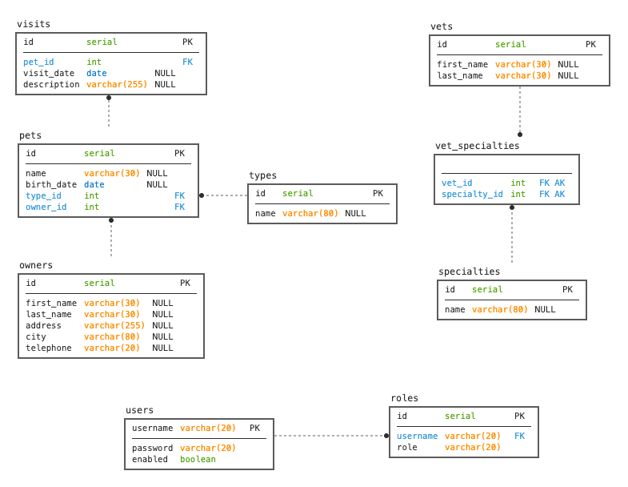

# Petclinic REST API

REST version of the Spring PetClinic sample application, adapted as the hands-on sample app for Thoughtworks' AIFSD 101 DevSecOps training.

> Derived from [spring-petclinic/spring-petclinic-rest](https://github.com/spring-petclinic/spring-petclinic-rest) (Apache License 2.0 — see `LICENSE.txt`).

**There is no UI** — this backend exposes a REST API only.
The [spring-petclinic-angular](https://github.com/spring-petclinic/spring-petclinic-angular) project provides the frontend.

---

## Project Structure

```
backend-scenario-java/
├── src/
│   ├── main/
│   │   ├── java/             # Application source code
│   │   └── resources/        # application.properties, DB scripts, openapi.yml
│   └── test/
│       ├── java/             # Unit & integration tests
│       ├── jmeter/           # JMeter load test plans
│       └── postman/          # Postman collections + Newman runner
├── observability/
│   ├── prometheus.yml        # Prometheus scrape config (15s interval)
│   ├── grafana-dashboard.json# 4-panel Grafana dashboard (importable)
│   └── setup.sh              # Observability-only setup script
├── start.sh                  # ⭐ One-command start (app + observability)
└── pom.xml
```

---

## Quick Start — One Command

> **Prerequisites:** Java 21, Prometheus, Grafana (all via Homebrew)
> ```bash
> brew install --cask temurin@21
> brew install prometheus
> brew install grafana
> ```

### Start everything

```bash
bash start.sh
```

Automatically:
1. Checks all prerequisites (Java, Prometheus, Grafana)
2. Starts Spring Boot app (background → `app.log`)
3. Starts Prometheus (scrapes every 15s)
4. Starts Grafana, provisions datasource, imports dashboard
5. Starts continuous traffic generator (4 endpoints every 2s)
6. Opens the live Grafana dashboard in your browser

### All commands

```bash
bash start.sh              # start everything
bash start.sh stop         # stop all services cleanly
bash start.sh status       # show what's running + pool metrics
bash start.sh errors       # generate 4xx error spike (visible in dashboard)
bash start.sh load         # run pool-exhaustion load test (20×50 requests)
bash start.sh demo         # full scenario: healthy → break → fix → verify
```

### Demo mode

`bash start.sh demo` runs a fully automated 3-phase observability scenario — no manual steps:

| Phase | What happens | Watch in Grafana |
|---|---|---|
| 🟢 **Phase 1** | Normal traffic for 30s with pool=20 | Low latency, steady request rate |
| 🔴 **Phase 2** | Reduces pool to 1, runs 1000 concurrent requests | P95 Latency spikes, acquire time increases |
| 🟢 **Phase 3** | Restores pool to 20, re-runs identical load test | Latency recovers, metrics back to baseline |

At the end, prints a before/after comparison table and opens the dashboard automatically.

---

## URLs

| Service | URL |
|---|---|
| App | http://localhost:9966/petclinic |
| Swagger UI | http://localhost:9966/petclinic/swagger-ui.html |
| Metrics | http://localhost:9966/petclinic/actuator/prometheus |
| Prometheus | http://localhost:9090/targets |
| Grafana | http://localhost:3000 |
| Dashboard | http://localhost:3000/d/petclinic-obs-v1 |

Grafana login: `admin` / `admin`

---

## Observability

### Metrics exposed

| Metric | Description |
|---|---|
| `http_server_requests_seconds_count` | Request rate per endpoint |
| `http_server_requests_seconds_bucket` | Request duration histogram |
| `jvm_memory_used_bytes` | JVM heap memory usage |
| `process_cpu_usage` | Process CPU usage |

### Grafana Dashboard Panels

| Panel | PromQL | Unit |
|---|---|---|
| Request Rate | `sum(rate(http_server_requests_seconds_count[5m]))` | req/s |
| Error Rate | 5xx / total requests | % |
| P95 Latency | `histogram_quantile(0.95, ...)` | seconds |
| Memory + CPU | heap bytes + CPU % | bytes / % |

### How it all connects

```
Spring Boot App (:9966)
    └── /actuator/prometheus  ←── Prometheus scrapes every 15s
                                         ↓
                                  Grafana queries Prometheus
                                         ↓
                                  4 live dashboard panels
                                         ↑
Traffic generator (background) ──────────┘
4 endpoints hit every 2s
```

---

## Database Configuration

Default: **H2 in-memory** — no setup required, works out of the box.

| Database | Profile |
|---|---|
| H2 (default) | `spring.profiles.active=h2,spring-data-jpa` |
| HSQLDB | `spring.profiles.active=hsqldb,spring-data-jpa` |
| MySQL | `spring.profiles.active=mysql,spring-data-jpa` |
| PostgreSQL | `spring.profiles.active=postgres,spring-data-jpa` |

To switch database, update `spring.profiles.active` in `src/main/resources/application.properties`.

For MySQL or PostgreSQL, start a database instance first:

```bash
# MySQL
docker run -e MYSQL_USER=petclinic -e MYSQL_PASSWORD=petclinic \
  -e MYSQL_ROOT_PASSWORD=root -e MYSQL_DATABASE=petclinic \
  -p 3306:3306 mysql:8.4

# PostgreSQL
docker run -e POSTGRES_USER=petclinic -e POSTGRES_PASSWORD=petclinic \
  -e POSTGRES_DB=petclinic -p 5432:5432 postgres:16.3
```

---

## API Endpoints

Full OpenAPI spec: [`src/main/resources/openapi.yml`](src/main/resources/openapi.yml)
Interactive docs: http://localhost:9966/petclinic/swagger-ui.html

| Method | Endpoint | Description |
|---|---|---|
| GET | `/api/owners` | List all owners |
| POST | `/api/owners` | Add owner |
| GET/PUT/DELETE | `/api/owners/{id}` | Get / update / delete owner |
| GET | `/api/vets` | List all vets |
| GET | `/api/pets` | List all pets |
| GET | `/api/pettypes` | List pet types |
| GET | `/api/specialties` | List specialties |
| GET | `/api/visits` | List visits |
| POST | `/api/users` | Create user |

---

## Testing

### Unit & Integration Tests
```bash
./mvnw test
```

### API Tests (Postman + Newman)
```bash
bash src/test/postman/postman-tests.sh
```

### Load Tests (JMeter)
```bash
jmeter -n -t src/test/jmeter/petclinic-jmeter-crud-benchmark.jmx \
  -Jthreads=100 -Jduration=600 -l results/petclinic-test-results.jtl
```

---

## Security

Security is **disabled by default** for local development.

To enable Basic Auth:
```properties
# application.properties
petclinic.security.enable=true
```

Default admin credentials: `admin` / `admin`

Roles:
- `OWNER_ADMIN` — owners, pets, visits
- `VET_ADMIN` — vets, specialties, pet types
- `ADMIN` — user management

---

## Troubleshooting

| Problem | Fix |
|---|---|
| App won't start — port in use | `lsof -ti:9966 \| xargs kill -9` |
| Prometheus target DOWN | Check `curl localhost:9966/petclinic/actuator/prometheus` |
| Grafana not loading | `brew services restart grafana` |
| No data in dashboard | Wait 30s — Prometheus needs 2 scrapes minimum |
| See app startup errors | `tail -f app.log` |
| See Prometheus errors | `tail -f observability/prometheus.log` |

---

## ER Model


